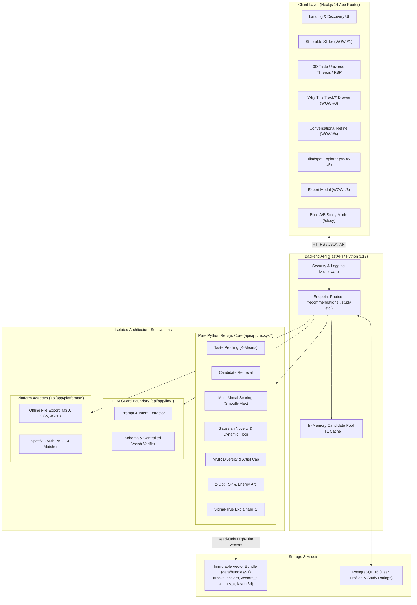

<div align="center">

# MELOVIA

**Explainable, Steerable Music Discovery Engine**

[](https://github.com/md-adil4106/Melovia/actions/workflows/ci.yml)
[](https://www.python.org/)
[](https://fastapi.tiangolo.com/)
[](https://nextjs.org/)
[](https://www.typescriptlang.org/)
[](https://tailwindcss.com/)
[](LICENSE)

[Quickstart](#quickstart-in-10-commands) •
[Architecture](#system-architecture) •
[6 WOW Moments](#the-6-wow-moments) •
[Evaluation & Benchmarks](#evaluation--benchmarks) •
[Limitations](#honest-scientific-limitations) •
[Documentation](#documentation-directory)

</div>

---

> [!NOTE]
> **What & Why**: Commercial streaming algorithms are optimized for passive background auto-play, session retention, and ad revenue. This often collapses listening habits into repetitive, commercial popularity bubbles.
>
> **Melovia** is an exploratory music-discovery engine designed to return steering agency, transparency, and adventurous exploration to the listener. It decomposes music into orthogonal semantic and acoustic spaces, provides instantaneous multi-factor steerability, and offers mathematical explanations for every recommendation.
>
> **Disclaimer**: Melovia is an open, independent research prototype. It does **not** claim to outperform commercial platforms (such as Spotify, Apple Music, or YouTube Music) on global catalog breadth or commercial click-through metrics.

---

## The 6 WOW Moments

Melovia is organized around six flagship discovery capabilities:

```
┌────────────────────────────────────────────────────────────────────────┐
│ WOW #1: STEERABLE FAMILIARITY ↔ DISCOVERY SLIDER                      │
│ Dynamically traverse from familiar sounds (0%) to adventurous long-   │
│ tail gems (100%) via Gaussian novelty shaping in sub-100ms.            │
├────────────────────────────────────────────────────────────────────────┤
│ WOW #2: INTERACTIVE 3D TASTE UNIVERSE                                  │
│ Explore 3,000+ catalog tracks in an interactive Three.js constellation.│
│ Invariant: 3D map visualizes and navigates; 256d vectors decide.       │
├────────────────────────────────────────────────────────────────────────┤
│ WOW #3: SIGNAL-TRUE "WHY THIS TRACK?" EXPLANATIONS                     │
│ Glass-box transparency: inspect exact cosine affinities, audio         │
│ resonance, novelty boosts, and MMR diversity contributions.            │
├────────────────────────────────────────────────────────────────────────┤
│ WOW #4: CONVERSATIONAL STEERING WITH VERIFIER GUARD                    │
│ "Too mainstream, darker and more experimental." LLM acts strictly as a │
│ schema-validated constraint mapper over controlled catalog vocabularies│
├────────────────────────────────────────────────────────────────────────┤
│ WOW #5: MUSICAL BLINDSPOTS & HORIZONS EXPLORER                         │
│ Detect unrepresented catalog regions outside your listening bubble     │
│ and receive gateway tracks that bridge your taste to uncharted sounds. │
├────────────────────────────────────────────────────────────────────────┤
│ WOW #6: ZERO-LOCKIN EXPORT & DOUBLE-BLIND STUDY MODE                   │
│ 100% offline M3U/CSV export or Spotify OAuth PKCE sync without tokens  │
│ touching a database. Run double-blind A/B trials in /study.            │
└────────────────────────────────────────────────────────────────────────┘
```

---

## System Architecture

Melovia maintains strict, non-negotiable architectural boundaries between its recommendation algorithms, language model integrations, platform adapters, and visualization layers.



### Architectural Invariants
1. **Pure Python Recsys (`api/app/recsys/*`)**: Zero imports of FastAPI, Starlette, SQLAlchemy, or database drivers. Deterministic execution with seeded RNGs and stable tie-breaking on `track_id`.
2. **Dual-Channel Vectors**: Semantic taste space ($t \in \mathbb{R}^{128}$) and acoustic descriptor space ($a \in \mathbb{R}^{128}$) are orthogonal. Tracks lacking audio analysis have `has_a = False` and strict zero vectors—never synthetically imputed.
3. **3D Map Visualizes, High-Dim Vectors Decide**: 3D coordinates in the Taste Universe are strictly for client navigation. All candidate selection, MMR diversification, and nearest-neighbor calculations operate on the true high-dimensional vectors.
4. **LLM Verifier Guard**: The LLM never ranks tracks, never invents metadata, and never writes ungrounded explanations. It only produces schema-validated constraints over controlled vocabularies.
5. **Zero Token Persistence & Privacy**: Spotify OAuth PKCE tokens are held strictly in server memory during active sessions and never persisted to disk or database. Client taste sharing generates high-resolution PNGs locally via HTML5 canvas with zero server uploads or PII.

---

## Quickstart in ≤10 Commands

Reproduce the full Melovia mock-catalog demo in under 15 minutes.

### Prerequisites
- [Python 3.12+](https://www.python.org/downloads/)
- [uv](https://docs.astral.sh/uv/) (Astral Python package manager)
- [Node.js 20+](https://nodejs.org/) & [pnpm](https://pnpm.io/)
- GNU Make or `mingw32-make` (Windows)

### 1. Clone & Setup Environment
```bash
git clone https://github.com/md-adil4106/Melovia.git
cd Melovia
cp .env.example .env
```

### 2. Generate Deterministic Mock Catalog
Generates a versioned bundle (`data/bundles/v1/`) with 3,000 tracks, 24 planted musical clusters, and deterministic embeddings:
```bash
make make-mock
```

### 3. Run Quality Checks
Executes backend linting, typechecking, 220+ unit tests, frontend typechecks, and 6 recommendation regression gates:
```bash
make check
```

### 4. Launch Development Servers
```bash
# Terminal 1: FastAPI Backend
cd api && uv run uvicorn app.main:app --reload --port 8000

# Terminal 2: Next.js Frontend
cd web && pnpm dev
```

- Open **[http://localhost:3000](http://localhost:3000)** in your browser.
- Backend health check: **[http://localhost:8000/health](http://localhost:8000/health)**
- Interactive Study Mode: **[http://localhost:3000/study](http://localhost:3000/study)**

---

## Real-World Catalog Ingestion

To build a catalog from real open-music datasets (MusicBrainz, ListenBrainz, AcousticBrainz):

```bash
# 1. Ingest sample (5,000 tracks) or full (50,000 tracks) staging catalog
make ingest-sample   # or: make ingest-full

# 2. Generate Data Quality Report
make dq-report

# 3. Extract features and build immutable, checksummed bundle
make build-bundle

# 4. Generate neighbor sanity report
make sanity-report
```

---

## Configuration Reference (`.env.example`)

| Variable Name | Default Value | Description |
| :--- | :--- | :--- |
| `ENV` | `development` | Runtime environment (`development`, `production`, `test`). |
| `DEBUG` | `true` | Enables detailed logging (disable in production). |
| `DATABASE_URL` | `postgresql+psycopg://...` | Connection URI for PostgreSQL 16 (falls back to memory if DB offline). |
| `API_HOST` | `127.0.0.1` | API host address. |
| `API_PORT` | `8000` | API port. |
| `CORS_ORIGINS` | `http://localhost:3000,...` | Allowed CORS origins for web requests. |
| `CATALOG_BUNDLE_DIR` | `../data/bundles/v1` | Path to unpacked catalog bundle. |
| `STUDY_ADMIN_TOKEN` | `secret-study-admin-token` | Bearer token for accessing `/study/export` CSV data. |
| `SPOTIFY_CLIENT_ID` | *(optional)* | Spotify Developer App Client ID for OAuth export. |
| `SPOTIFY_CLIENT_SECRET`| *(optional)* | Spotify Developer App Client Secret. |
| `GEMINI_API_KEY` | *(optional)* | Google Gemini API key for natural language steering (rule fallback if unset). |

---

## Evaluation & Benchmarks

Melovia evaluates recommendation geometry, diversity, and novelty using paired bootstrap confidence intervals ($B=1,000$) across 36 diverse seed sets:

```bash
# Run full comparative evaluation
make eval

# Run CI regression gates
make eval-ci
```

### Empirical Results (Real Numbers from Shipped Bundle)

| Recommender Configuration | Intra-List Diversity (ILD) | $\Delta$ vs Hybrid (95% CI) | Novelty (bits) | Region Entropy | Catalog Exposure Gini |
| :--- | :---: | :---: | :---: | :---: | :---: |
| `random` (Reference) | 0.985 ± 0.000 | [-0.791, -0.756] | 12.37 | 3.95 | 0.990 |
| `genre_only` (Baseline) | 0.204 ± 0.088 | [-0.018, +0.028] | 11.40 | 0.18 | 0.829 |
| `cosine_t` (Tags Only) | 0.155 ± 0.036 | [+0.043, +0.067] | 11.90 | 0.12 | 0.788 |
| `cosine_a` (Audio Only) | 0.180 ± 0.047 | [+0.009, +0.048] | 11.91 | 0.13 | 0.788 |
| **`hybrid_d00` (Familiar)** | **0.158 ± 0.033** | **[+0.040, +0.064]** | **11.88** | **0.13** | **0.783** |
| **`hybrid_d35` (Default)** | **0.210 ± 0.057** | **Reference (0.00)** | **12.41** | **0.30** | **0.786** |
| **`hybrid_d75` (Discovery)** | **0.831 ± 0.060** | **[-0.644, -0.597]** | **12.50** | **3.41** | **0.801** |
| `hybrid_no_audio` (Ablation)| 0.168 ± 0.061 | [+0.029, +0.054] | 12.15 | 0.14 | 0.785 |
| `hybrid_no_mmr` (Ablation) | 0.166 ± 0.047 | [+0.032, +0.055] | 12.40 | 0.13 | 0.785 |

*Complete evaluation methodology and mathematical formulations are documented in [`docs/EVAL.md`](docs/EVAL.md).*

---

## Honest Scientific Limitations

We believe in scientific honesty over marketing claims:

1. **Circularity Notice**: Offline metrics (ILD, entropy, hit-rate) evaluate vector-space geometry, **not** human listener delight. A high seed-region hit-rate is a mathematical sanity check of cluster coherence, not proof of recommendation superiority.
2. **AcousticBrainz Temporal Freeze (2022)**: AcousticBrainz permanently ceased accepting crowdsourced submissions in 2022. Tracks released after 2022 have $0\%$ coverage in public acoustic dumps, requiring local Essentia feature extraction or semantic-only retrieval.
3. **Heuristic Proxies**: `energy_idx` and `valence_idx` are approximate mathematical proxies derived from acoustic features, not subjective psychological ground truths.
4. **Dataset Skew**: Community folksonomy tags skew heavily toward Western, Anglophone, and electronic/rock genres. Sparser tags exist for classical, regional folk, and non-Western traditions.
5. **Catalog Scale**: The bundled mock catalog contains 3,000 tracks and staging catalogs support up to 50,000 tracks. It does not attempt to replicate the 100M+ track catalog scale of major commercial platforms.

---

## Documentation Directory

| Document | Purpose |
| :--- | :--- |
| [`docs/ARCHITECTURE.md`](docs/ARCHITECTURE.md) | Complete architectural boundaries, data flow, and subsystem contracts. |
| [`docs/ML_DESIGN.md`](docs/ML_DESIGN.md) | Mathematical formulations for dual channels, scoring, steerability, and sequencing. |
| [`docs/EVAL.md`](docs/EVAL.md) | Evaluation methodology, metrics, empirical benchmark tables, and CI gates. |
| [`docs/DATA_CARD.md`](docs/DATA_CARD.md) | Data provenance, schema specifications, preprocessing, and demographic biases. |
| [`docs/MODEL_CARD.md`](docs/MODEL_CARD.md) | Model architecture, intended use, heuristic proxy definitions, and known limitations. |
| [`docs/DEMO_SCRIPT.md`](docs/DEMO_SCRIPT.md) | Rehearsed 5-minute demonstration script across all 6 WOW moments with fallbacks. |
| [`docs/DEPLOYMENT.md`](docs/DEPLOYMENT.md) | Production recipes for Vercel, Render/Fly.io, Neon Postgres, and Docker Compose. |
| [`docs/STUDY_PROTOCOL.md`](docs/STUDY_PROTOCOL.md) | Double-blind randomized A/B user study methodology, Likert scales, and analysis. |
| [`docs/SECURITY.md`](docs/SECURITY.md) | Threat model, rate limiting, security headers, and Git secret scan audits. |
| [`docs/PLATFORMS.md`](docs/PLATFORMS.md) | Spotify OAuth PKCE setup, matching cascade, and offline file adapters. |
| [`docs/RUNBOOK.md`](docs/RUNBOOK.md) | Operations runbook, telemetry health endpoints, and failure recovery. |
| [`docs/ADR/`](docs/ADR/) | Index of 5 Architectural Decision Records. |

---

## Upstream Licences & Attributions

- **Melovia Source Code**: Licensed under the [MIT License](LICENSE).
- **MusicBrainz**: Metadata and folksonomy tags are provided by the [MetaBrainz Foundation](https://metabrainz.org/) under [CC0 / ODbL 1.0](https://musicbrainz.org/doc/MusicBrainz_Database/Download).
- **ListenBrainz**: Scrobble statistics are provided by [ListenBrainz](https://listenbrainz.org/) under [CC0 1.0 Universal](https://listenbrainz.org/data/).
- **AcousticBrainz**: Audio descriptors are provided by [AcousticBrainz](https://acousticbrainz.org/) under [CC0 1.0 Universal](https://acousticbrainz.org/download).
- **Sentence-Transformers**: `all-MiniLM-L6-v2` is distributed by Hugging Face / UKPLab under the [Apache License 2.0](https://huggingface.co/sentence-transformers/all-MiniLM-L6-v2).

---

<div align="center">
Built with dedication to open data, listener privacy, and explainable AI.
</div>
