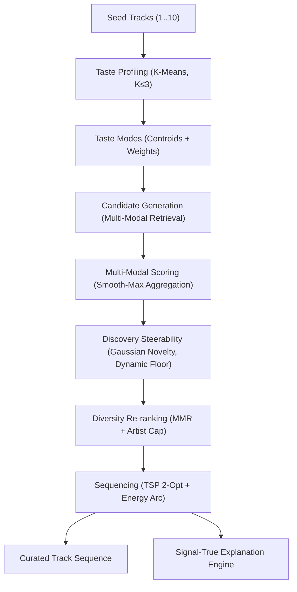

# Melovia Model Card

## 1. Model Overview

- **Model Name**: Melovia Multi-Modal Discovery Engine
- **Version**: 1.0.0
- **Model Type**: Dual-channel hybrid recommender with steerable Gaussian novelty control, Maximal Marginal Relevance (MMR) diversity, and Traveling Salesperson (TSP) playlist sequencing.
- **Intended Domain**: User-steerable music discovery, niche exploration, and explainable playlist curation.
- **Out-of-Scope Uses**:
  - Passive background autoplay maximizing session watch-time or ad revenue.
  - Surveillance-based behavioral advertising or personal profiling.
  - Automated copyright detection or audio fingerprinting.

---

## 2. Core Architecture & Pipeline Components

The recommendation pipeline operates entirely in pure Python (`api/app/recsys/*`) with zero runtime database or framework dependencies:

### Component Breakdown
1. **Semantic Channel ($t$)**:
   - `all-MiniLM-L6-v2` sentence-transformer encodes structured folksonomy tags, genres, and artist descriptors into 384d vectors.
   - Truncated SVD / PCA projects embeddings to $128$ dimensions, retaining $>95\%$ variance. L2-normalized.
2. **Acoustic Channel ($a$)**:
   - 7 standardized acoustic descriptors (BPM, danceability, energy, valence, acousticness, instrumentalness, loudness) projected via SVD to $128$ dimensions (or $64$d for compact builds). L2-normalized.
   - Missing audio tracks retain $\mathbf{0} \in \mathbb{R}^{128}$ with boolean masking; zero synthetic imputation.
3. **Multi-Seed Taste Profiling (`recsys/taste.py`)**:
   - Clusters seed tracks into $K \in \{1, 2, 3\}$ taste modes using deterministic K-Means with inverse inertia weights ($w_m$).
4. **Discovery Utility & Dynamic Floor (`recsys/rerank.py`)**:
   - Target Gaussian novelty centered at $n^* = d$, where $d \in [0.0, 1.0]$ is the user's slider setting:
     $$N_i = \exp\left(-\frac{(\text{nov}_i - d)^2}{2\sigma_d^2}\right)$$
   - Utility combining base affinity and novelty:
     $$U_i = (1 - d) \cdot S_i + d \cdot N_i$$
   - Dynamic relevance floor $R_{\text{floor}} = \max(0.15, 0.40 \cdot (1 - 0.5d))$ prevents unlistenable drift.
5. **Diversity Reranking (MMR)**:
   - Balances item utility against similarity to already selected tracks with a hard artist cap ($k \le 2$ tracks per artist).
6. **Playlist Sequencing (`recsys/sequencing.py`)**:
   - Solves acoustic transition smoothness via 2-opt TSP optimization paired with target energy arc shaping (Rising, Peaking, Storyteller, Chill Plateau).
7. **Signal-True Explanations (`recsys/explain.py`)**:
   - Computes mathematical ranking contributions (seed cosine similarity, acoustic proximity, novelty boost, MMR diversification). Explanations are deterministic and 100% grounded in ranking signals.
8. **Conversational Steering & Verifier Guard (`api/app/llm/*`)**:
   - Translates natural language refinement requests into structured vector shifts and scalar target modifiers. The verifier guard strictly strips ungrounded tags and clips out-of-bounds adjustments.

---

## 3. Heuristic Proxy Definitions

Interpretable scalars in `scalars.parquet` directly drive user steerability:

| Proxy Scalar | Mathematical Formula | Musical Interpretation |
| :--- | :--- | :--- |
| `energy_idx` | $0.45 \cdot \text{energy} + 0.35 \cdot \text{danceability} + 0.20 \cdot \text{clip}\left(\frac{\text{loudness} + 30}{30}, 0, 1\right)$ | Perceived acoustic drive, rhythmic intensity, and dynamic presence. |
| `valence_idx` | $0.50 \cdot \text{valence} + 0.25 \cdot \text{danceability} + 0.25 \cdot (1.0 - \text{acousticness})$ | Harmonic brightness, tonal positivity, and upbeat feel. |
| `tempo_norm` | $\text{clip}\left(\frac{\text{BPM} - 50}{150}, 0.0, 1.0\right)$ | Standardized tempo relative to typical listening range (50–200 BPM). |

---

## 4. Quantitative Benchmark Performance

Empirical metrics measured across 36 diverse seed sets on the catalog bundle:

| Configuration | Intra-List Diversity (ILD) | $\Delta$ vs Hybrid (95% CI) | Novelty (bits) | Region Entropy | Catalog Exposure Gini |
| :--- | :---: | :---: | :---: | :---: | :---: |
| `random` | 0.985 ± 0.000 | [-0.791, -0.756] | 12.37 | 3.95 | 0.990 |
| `genre_only` | 0.204 ± 0.088 | [-0.018, +0.028] | 11.40 | 0.18 | 0.829 |
| `cosine_t` | 0.155 ± 0.036 | [+0.043, +0.067] | 11.90 | 0.12 | 0.788 |
| `cosine_a` | 0.180 ± 0.047 | [+0.009, +0.048] | 11.91 | 0.13 | 0.788 |
| **`hybrid_d00` (Familiar)** | **0.158 ± 0.033** | **[+0.040, +0.064]** | **11.88** | **0.13** | **0.783** |
| **`hybrid_d35` (Default)** | **0.210 ± 0.057** | **Reference (0.00)** | **12.41** | **0.30** | **0.786** |
| **`hybrid_d75` (Discovery)** | **0.831 ± 0.060** | **[-0.644, -0.597]** | **12.50** | **3.41** | **0.801** |
| `hybrid_no_audio` | 0.168 ± 0.061 | [+0.029, +0.054] | 12.15 | 0.14 | 0.785 |
| `hybrid_no_mmr` | 0.166 ± 0.047 | [+0.032, +0.055] | 12.40 | 0.13 | 0.785 |

---

## 5. Known Biases & Scientific Caveats

1. **Representation Circularity**:
   - Offline diversity, entropy, and hit-rate measure vector space geometric properties. They are not psychological proof of user delight.
2. **Popularity Exposure & Gini Distribution**:
   - Without the $(1 - P_i)$ penalty, recommenders suffer from severe Matthew effects (superstar bias). Melovia explicitly counteracts this with inverse-popularity self-information novelty.
3. **Acoustic Production Era Drift**:
   - Historical recordings from the 1960s–1980s have different dynamic range compression and frequency responses than contemporary masters. This can lead to clustering by mastering era rather than composition style if unnormalized.
4. **No Superiority Claims**:
   - Melovia is an open, steerable research system. It does not claim to outperform commercial platforms (Spotify, Apple Music, YouTube Music) on global retention or click-through rates.
